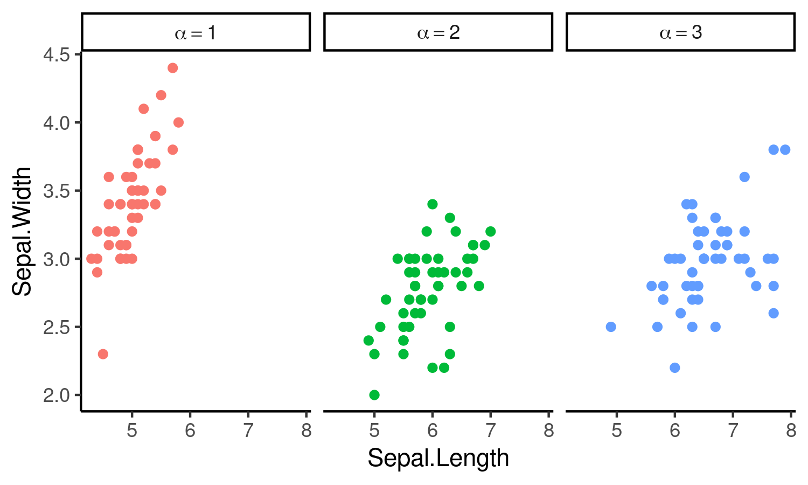

# ggfacet

An R package with wrappers around `ggplot2`'s facetting functions, with a special emphasis on displaying mathematical expressions in facet strips.

For example:

Install the package by using `devtools::install_github("rscherrer/ggfacet")` or by downloading this repository and building it from source. Check [this](https://www.displayr.com/installing-r-packages-from-github/) for help on installing R packages from GitHub.

Check out the vignette for information on how to use the package, using `browseVignettes("ggfacet")` (you need to specify `build_vignettes = TRUE` in `install_github` when installing the package).
